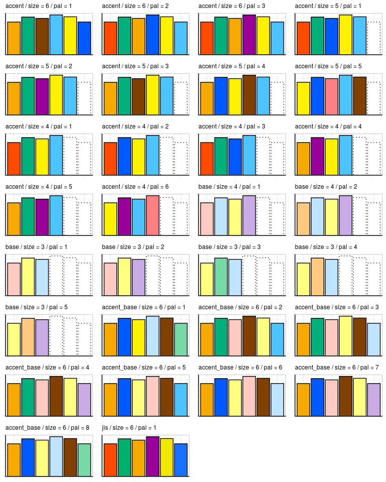

<!-- README.md is generated from README.Rmd. Please edit that file -->

# {cudpalette}

<!-- badges: start -->

[](https://opensource.org/licenses/MIT)

<!-- badges: end -->

Create color palette function using model color palette for Color
Universal Design (Color Universal Design Organization, 2018,
<https://cudo.jp/?page_id=1565>).

## About this package (in Japanese)

CUDO（NPO法人
カラーユニバーサルデザイン機構）により示されている「カラーユニバーサルデザイン推奨配色セット
ver.4」(<https://cudo.jp/?page_id=1565>)
および「カラーユニバーサルデザイン推奨配色セット ガイドブック
第2版」（[PDF](https://cudo.jp/wp-content/uploads/2018/10/cud_guidebook.pdf)）の「比較的見分けやすい組み合わせ（画面用）」をカラーパレットとして利用できるようにする。

### Functions :

**cud_color(colname)**

CUD推奨カラーパレットの色名からカラーコードを取得。存在しない色は NA
を返す

<table>
<thead>
<th>
colname
</th>
<th>
value
</th>
<th>
sample
</th>
</thead>
<tbody>
<tr>
<td>
red
</td>
<td>
`#FF4B00`
</td>
<td style="background-color:#FF4B00">
 
</td>
</tr>
<tr>
<td>
yellow
</td>
<td>
`#FFF100`
</td>
<td style="background-color:#FFF100">
 
</td>
</tr>
<tr>
<td>
green
</td>
<td>
`#03AF7A`
</td>
<td style="background-color:#03AF7A">
 
</td>
</tr>
<tr>
<td>
blue
</td>
<td>
`#005AFF`
</td>
<td style="background-color:#005AFF">
 
</td>
</tr>
<tr>
<td>
skyblue
</td>
<td>
`#4DC4FF`
</td>
<td style="background-color:#4DC4FF">
 
</td>
</tr>
<tr>
<td>
pink
</td>
<td>
`#FF8082`
</td>
<td style="background-color:#FF8082">
 
</td>
</tr>
<tr>
<td>
orange
</td>
<td>
`#F6AA00`
</td>
<td style="background-color:#F6AA00">
 
</td>
</tr>
<tr>
<td>
purple
</td>
<td>
`#990099`
</td>
<td style="background-color:#990099">
 
</td>
</tr>
<tr>
<td>
brown
</td>
<td>
`#804000`
</td>
<td style="background-color:#804000">
 
</td>
</tr>
<tr>
<td>
lightpink
</td>
<td>
`#FFCABF`
</td>
<td style="background-color:#FFCABF">
 
</td>
</tr>
<tr>
<td>
cream
</td>
<td>
`#FFFF80`
</td>
<td style="background-color:#FFFF80">
 
</td>
</tr>
<tr>
<td>
lightyellowgreen
</td>
<td>
`#D8F255`
</td>
<td style="background-color:#D8F255">
 
</td>
</tr>
<tr>
<td>
lightskyblue
</td>
<td>
`#BFE4FF`
</td>
<td style="background-color:#BFE4FF">
 
</td>
</tr>
<tr>
<td>
beige
</td>
<td>
`#FFCA80`
</td>
<td style="background-color:#FFCA80">
 
</td>
</tr>
<tr>
<td>
lightgreen
</td>
<td>
`#77D9A8`
</td>
<td style="background-color:#77D9A8">
 
</td>
</tr>
<tr>
<td>
lightpurple
</td>
<td>
`#C9ACE6`
</td>
<td style="background-color:#C9ACE6">
 
</td>
</tr>
<tr>
<td>
white
</td>
<td>
`#FFFFFF`
</td>
<td style="background-color:#FFFFFF">
 
</td>
</tr>
<tr>
<td>
lightgray
</td>
<td>
`#C8C8CB`
</td>
<td style="background-color:#C8C8CB">
 
</td>
</tr>
<tr>
<td>
lightgrey
</td>
<td>
`#C8C8CB`
</td>
<td style="background-color:#C8C8CB">
 
</td>
</tr>
<tr>
<td>
gray
</td>
<td>
`#84919E`
</td>
<td style="background-color:#84919E">
 
</td>
</tr>
<tr>
<td>
grey
</td>
<td>
`#84919E`
</td>
<td style="background-color:#84919E">
 
</td>
</tr>
<tr>
<td>
black
</td>
<td>
`#000000`
</td>
<td style="background-color:#000000">
 
</td>
</tr>
</tbody>
</table>

**cud_pal(type = “accent”, size = 6, pal = 1, direction = 1, warn =
TRUE)**

「比較的見分けやすい組み合わせ」をパレットとして使用する。デフォルトはアクセントカラー
6色のひとつ  
色が足りない場合は警告メッセージ（warn = F でoff可）を出してループで使用

## Installation

``` r
remotes::install_github("mokztk/cudpalette")
```

## Example

### basic usage

``` r
library(cudpalette)

cud_color("red")
#> [1] "#FF4B00"

cud_color(c("red", "blue", "magenta", "purple"))
#> undefined color name : magenta
#> [1] "#FF4B00" "#005AFF" NA        "#990099"

cud_pal()()
#> [1] "#F6AA00" "#FFF100" "#03AF7A" "#005AFF" "#4DC4FF" "#804000"

cud_pal(type = "a", size = 5, pal = 2, direction = -1)()
#> [1] "#990099" "#4DC4FF" "#03AF7A" "#FFF100" "#F6AA00"

cud_pal(type = "a", size = 7, pal = 2, direction = -1)()
#> Warning in cud_pal(type = "a", size = 7, pal = 2, direction = -1): 'size'
#> should be in 1:6. Default (6) will be used.
#> [1] "#4DC4FF" "#005AFF" "#03AF7A" "#FFF100" "#F6AA00" "#FF4B00"

cud_pal(type = "a", size = 5, pal = 2, direction = -1)(6)
#> Warning in cud_pal(type = "a", size = 5, pal = 2, direction = -1)(6): Requested
#> colors (6) > this palette (5). The palette will be used repeatedly.
#> [1] "#990099" "#4DC4FF" "#03AF7A" "#FFF100" "#F6AA00" "#990099"

cud_pal(type = "a", size = 5, pal = 2, direction = -1, warn = FALSE)(6)
#> [1] "#990099" "#4DC4FF" "#03AF7A" "#FFF100" "#F6AA00" "#990099"
```

### color palette sample


